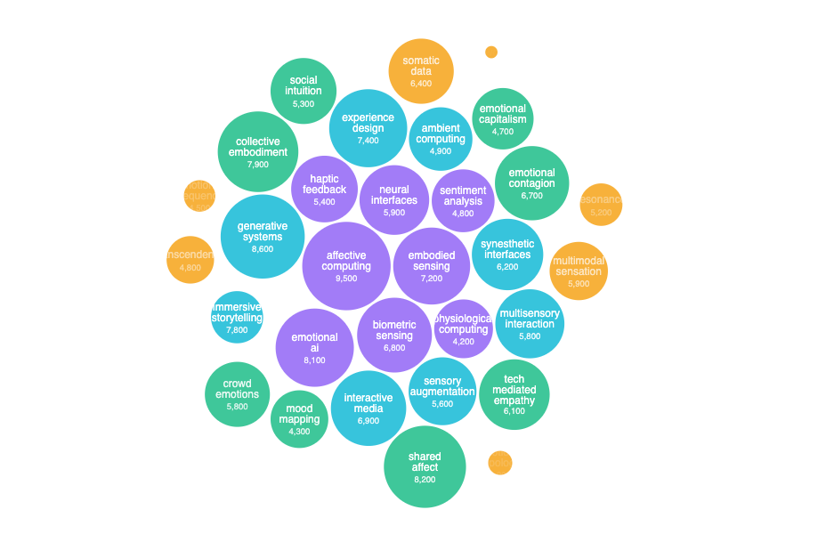

# Vulnerable Connections
Vulnerable Connections: Technology, Emotion, and Collective Experience

===

# Keywords & Intersections

===

# Background Research
AI and Humanity? **AI's Weightless Emotions**. True comfort comes not from understanding, but from **shared vulnerability**. How can technology help us evolve by embracing our emotional flaws and vulnerabilities?

===

# Emotion as Social Construction
**The Constructed Nature of Emotion**. **Immeasurable Complexity**. **AI's Role in Emotional Construction**. AI doesn't read emotions—it **creates** them. Not neutral. Emotions are transformed into abstracted, quantified, controllable data points.

===

# Situational Technology & Critical Positioning
**Western-Centric Limitations**. **Technology is not neutral**—social, cultural, political contexts matter. **Against Emotional Commodification**. **Accessibility and Equity**. **Privacy and Autonomy**.

===

# Political Dimensions & Power Analysis
**Politics of Emotional Technology**: Who controls emotional data and defines valid emotional categories? How are collective emotions commodified? Does technological empathy democratize understanding or create new forms of **emotional surveillance**?

===

# Critical Issues in Emotional Data
Key considerations when dealing with emotional data: **authenticity**, **consent**, **representation**, **algorithmic bias**, **cultural sensitivity**, and the **ethics of emotional manipulation**.

===

# Historical Development
Computer Science/AI emotional recognition technology's historical trajectory from **rule-based systems** to **machine learning** to **deep neural networks**—each iteration reshaping how we understand and categorize human emotion.

===

# Global Emotional Bias Map
Community emotional culture bias worldwide—mapping how different cultures conceptualize, express, and value emotional experiences, revealing the **limitations of universalist AI approaches**.

===

# Community
Building **inclusive emotional technologies** that honor diverse ways of experiencing and expressing emotion while fostering genuine human connection rather than extractive data collection.

===

# Core Emotional Data Parameters
Key parameters in emotional data extraction: **facial expressions**, **vocal patterns**, **physiological signals**, **textual sentiment**, **contextual information**, and their **inherent limitations**.

===

# Prior Research - 1
Ben Grosser's **"Computers Watching Movies"**—exploring how machine vision interprets emotional content and the **gap between algorithmic analysis and human emotional experience**.

===

# Prior Research - 2
**"Cleansing Emotional Data"**—examining how emotional datasets are preprocessed, normalized, and **sanitized**, often erasing cultural nuance and individual complexity.

===

# Research Question
If emotions are no longer passively recorded but actively **shaped by technology**, can we design systems that respect emotional complexity and vulnerability—ensuring that technologically **augmented senses foster meaningful collective emotional experiences**?

===

# Methodology & Approach
1. **Problem identification**: Limitations of emotional datafication
2. **Methodology**: Qualitative/quantitative/multisensory experiments  
3. **Core elements**: Space/sound/algorithms/visualization/criticism
4. **Experience design**: Immersion, interaction, temporality
5. **Aesthetic/critical reflection**: Data→sensation→data reduction, emphasizing **gaps**

===

# Design Experiments
**Synesthetic objects** (visual + auditory): 

**Stickiness** → resistant surfaces & persistent low-frequency tones

**Sharpness** → angular forms & immediate audio feedback

**Weight** → dense materials & full-body low-frequency resonance

===

# Future Applications
Creating **bridges between emotional language and embodied experience**, challenging the **reductive violence of emotional quantification** through direct multisensory encounter.

===

# Project Impact & Vision
**This Semester**: Reveal reductive violence of emotional datafication through **experiential critique**

**Long-term**: Develop critical emotional technology design frameworks that **facilitate collective emotional experiences** and **community resonance**